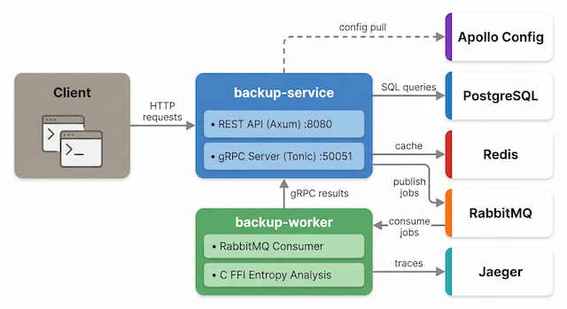

# Backup Service

Multi-binary Rust backend for managing, scheduling, and analyzing data backups. Built as a learning project that exercises production-grade patterns: async HTTP/gRPC, message queues, caching, FFI, observability, and container orchestration.

## Architecture

Two binaries communicate through RabbitMQ (job dispatch) and gRPC (result reporting), backed by PostgreSQL, Redis, and Jaeger.



Data flow and details: [docs/architecture.md](docs/architecture.md)

## Technology Stack

| Layer | Technology |
|-------|-----------|
| HTTP | Axum 0.8, Tower middleware |
| gRPC | Tonic 0.12, Protobuf (Prost) |
| Database | PostgreSQL 16 (SQLx 0.8) |
| Cache | Redis 7 |
| Message queue | RabbitMQ 3 (lapin) |
| Auth | JWT (jsonwebtoken) |
| Observability | tracing + OpenTelemetry → Jaeger, Prometheus metrics |
| FFI | C Shannon entropy calculator (cc crate) |
| Containers | Docker, docker-compose, Kubernetes |
| CI | GitHub Actions |

## Workspace Structure

```
backup-service/
├── crates/
│   ├── backup-common/     # shared: proto types, AMQP, FFI, telemetry
│   ├── backup-service/    # REST API + gRPC server binary
│   └── backup-worker/     # RabbitMQ consumer + gRPC client binary
├── proto/                 # Protobuf definitions
├── migrations/            # SQL migrations
├── k8s/                   # Kubernetes manifests
└── docs/                  # Architecture, design, and ops docs
```

Each crate has its own README with detailed module docs:
[backup-common](crates/backup-common/README.md) ·
[backup-service](crates/backup-service/README.md) ·
[backup-worker](crates/backup-worker/README.md)

## Quick Start

### Docker Compose (recommended)

```bash
docker-compose up --build
```

This starts both services and all infrastructure (PostgreSQL, Redis, RabbitMQ, Jaeger). The API is available at `http://localhost:8080`.

### Local Development

```bash
docker-compose up db redis rabbitmq jaeger -d   # infrastructure only
cp .env.example .env
cargo run --bin backup-service                   # terminal 1
cargo run --bin backup-worker                    # terminal 2
```

<details>
<summary>Build Docker images individually</summary>

```bash
docker build -t backup-service:latest -f Dockerfile.service .
docker build -t backup-worker:latest -f Dockerfile.worker .
```

Podman works too — replace `docker` with `podman`.

</details>

## Testing

```bash
cargo test --lib                  # unit tests (no DB needed)
cargo test --workspace            # all tests (needs PostgreSQL running)
cargo clippy --workspace --all-targets -- -D warnings
cargo fmt --all -- --check
```

CI runs these automatically — see [docs/ci-cd.md](docs/ci-cd.md).

### Git hooks

Pre-commit (fmt + clippy) is managed by [cargo-husky](https://github.com/rhysd/cargo-husky). Hooks are installed automatically when you run **cargo test** (or **cargo build**) in the workspace — no install script. After that, each commit runs `cargo fmt --all` (re-staging changes), then `cargo clippy --workspace --all-targets -- -D warnings`, and the commit is aborted if clippy fails. Hook sources: [.cargo-husky/hooks/](.cargo-husky/hooks/).

## Deployment

<details>
<summary>Kubernetes</summary>

```bash
kubectl apply -f k8s/config.yaml
kubectl apply -f k8s/deployment.yaml
kubectl apply -f k8s/service.yaml
kubectl apply -f k8s/hpa.yaml
```

Includes Deployments (API + Worker), HPA auto-scaling, Ingress with TLS, and per-component ConfigMaps/Secrets. See [k8s/](k8s/) for manifest details.

</details>

<details>
<summary>Docker strategy</summary>

Two separate images, one process per image:
- `Dockerfile.service` → `backup-service:latest`
- `Dockerfile.worker` → `backup-worker:latest`

See [docs/docker-strategy.md](docs/docker-strategy.md) for rationale.

</details>

<details>
<summary>API endpoints</summary>

**Public:**

| Method | Path | Description |
|--------|------|-------------|
| `POST` | `/api/v1/auth/login` | Get JWT token |
| `GET` | `/health` | Liveness probe |
| `GET` | `/ready` | Readiness probe (DB + Redis) |
| `GET` | `/metrics` | Prometheus metrics |

**Protected** (`Authorization: Bearer <token>`):

| Method | Path | Description |
|--------|------|-------------|
| `POST` | `/api/v1/backups` | Create backup |
| `GET` | `/api/v1/backups` | List (paginated, filterable) |
| `GET` | `/api/v1/backups/{id}` | Get by ID |
| `PATCH` | `/api/v1/backups/{id}` | Update status/size |
| `DELETE` | `/api/v1/backups/{id}` | Delete |
| `POST` | `/api/v1/backups/{id}/analyze` | Entropy analysis (FFI) |
| `POST` | `/api/v1/backups/{id}/process` | Enqueue to RabbitMQ |

All protected endpoints are rate-limited per tenant (`X-RateLimit-*` headers).

Full endpoint docs: [crates/backup-service/README.md](crates/backup-service/README.md)

</details>

<details>
<summary>Usage examples</summary>

```bash
# Login
TOKEN=$(curl -s localhost:8080/api/v1/auth/login \
  -H "Content-Type: application/json" \
  -d '{"username":"admin","password":"admin"}' | jq -r .token)

# Create a backup
curl -s localhost:8080/api/v1/backups \
  -H "Authorization: Bearer $TOKEN" \
  -H "Content-Type: application/json" \
  -d '{"source_path":"/data/important","encryption_enabled":true}' | jq

# List backups
curl -s "localhost:8080/api/v1/backups?limit=10" \
  -H "Authorization: Bearer $TOKEN" | jq

# Entropy analysis (FFI demo)
BACKUP_ID=$(curl -s localhost:8080/api/v1/backups \
  -H "Authorization: Bearer $TOKEN" | jq -r '.items[0].id')
curl -s -X POST "localhost:8080/api/v1/backups/$BACKUP_ID/analyze" \
  -H "Authorization: Bearer $TOKEN" | jq

# Enqueue for async processing (RabbitMQ → worker → gRPC)
curl -s -X POST "localhost:8080/api/v1/backups/$BACKUP_ID/process" \
  -H "Authorization: Bearer $TOKEN" | jq

# Health + metrics
curl -s localhost:8080/health | jq
curl -s localhost:8080/metrics
```

</details>

<details>
<summary>Observability</summary>

- **Tracing**: Distributed traces via OpenTelemetry → Jaeger UI at `http://localhost:16686`
- **Metrics**: Prometheus-format at `/metrics`
- **Logs**: Structured (`tracing`), controlled by `RUST_LOG`

```bash
RUST_LOG=backup_service=debug,tower_http=debug   # API
RUST_LOG=backup_worker=debug                      # Worker
```

</details>

<details>
<summary>Concepts exercised</summary>

| Area | What's demonstrated |
|------|---------------------|
| Rust Core | Newtypes, enums, traits, `Result`/`?`, `Arc`, `Mutex` |
| HTTP/REST | Axum routing, extractors, Tower middleware, CORS, compression |
| gRPC | Tonic server/client, protobuf codegen, inter-service calls |
| Auth | JWT create/verify, middleware, role-based access |
| Database | SQLx + PostgreSQL: pooling, migrations, parameterized queries |
| Async | Tokio runtime, `select!`, graceful shutdown, `spawn_blocking` |
| Messaging | RabbitMQ: durable exchange/queue, ack/reject, dead-letter |
| Caching | Redis with TTL, invalidation on writes, graceful degradation |
| FFI | C code called from Rust, `cc` build, `unsafe` with SAFETY docs |
| Testing | Unit + integration tests, rate limiter tests, proto tests |
| Observability | Structured logs, distributed tracing, Prometheus metrics |
| DevOps | Docker multi-stage, Kubernetes, HPA, GitHub Actions CI |

</details>

## Configuration

When `APOLLO_CONFIG_URL` is set, the API server periodically fetches config from that URL and updates rate limits and cache-related settings in memory. Only a defined subset of options is overridden; URLs and secrets are never updated from the remote. See [Apollo Config Updater](docs/apollo-config-updater.md) for env vars and payload format.

## Documentation

| Document | Contents |
|----------|----------|
| [Architecture](docs/architecture.md) | System diagram, data flow, tech stack |
| [Apollo Config Updater](docs/apollo-config-updater.md) | Remote config pull, env vars, payload format, tests |
| [CI/CD](docs/ci-cd.md) | GitHub Actions workflow, path filters, local testing |
| [Docker Strategy](docs/docker-strategy.md) | Two-image approach, build commands |
| [Module Layout](docs/module-layout.md) | File naming conventions (no `mod.rs`) |
